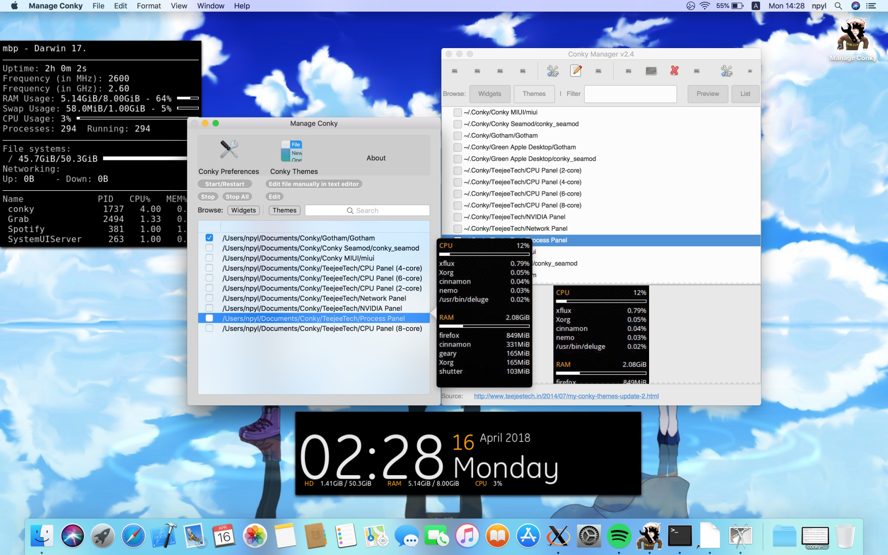

<h1 align="center">
  <a></a>
  <br>
  Manage Conky
  <br>
</h1>

<h4 align="center">ManageConky is the implementation of <a href="https://github.com/teejee2008/conky-manager" target="_blank">conky-manager</a> for macOS.</h4>

It offers on the mac what conky-manager offers on linux plus alot more (exclusive) [amazing features](https://github.com/Conky-for-macOS/Manage-Conky/wiki).



## INSTALL 💾

To install grab the [Latest Release](https://github.com/Conky-for-macOS/Manage-Conky/releases/latest).

## BUILD 🏗

Follow [this](https://github.com/Conky-for-macOS/Manage-Conky/wiki/Build) (relatively) small guide.

## AKNOWLEDGEMENTS 📖

- [conky](https://github.com/brndnmtthws/conky) - Original conky
- [conky-for-macOS](https://github.com/Conky-for-macOS/conky-for-macOS) - The port
- [ConkyX](https://github.com/Conky-for-macOS/ConkyX) - Conky quick-launcher
- [conky-manager](https://github.com/teejee2008/conky-manager) - The app that ManageConky mimics
- [LetsMove](https://github.com/potionfactory/LetsMove) - Move to Applications Library
- [default-themes](https://github.com/Conky-for-macOS/default-themes) - This is where we get the themes

### This project uses [cocoapods](https://cocoapods.org/) as supplier of these frameworks:
- [Sparkle Framework](https://sparkle-project.org) - Updating mechanism
- [AHLaunchCtl](https://github.com/eahrold/AHLaunchCtl) - Controlling LaunchD

## CONTRIBUTE 🤝

In order to contribute you need 2 things:

- Learn about ManageConky's design and setup your workspace using [this](https://github.com/Conky-for-macOS/Manage-Conky/wiki/Maintain) guide
- Open a PR with your change

## DONATING 💰

***PayPal coming soon 👊***

```
BTC: 31qFE5JFeReEftU1sjDqigUDmpxYuTdwQm
BCH: qq04pjvvlx406r7pd9dm3ft2smc4qc2njyjccpd6kw
LTC: 3N1EuxbmeXeTFjLEqmHeZfjK7HUig9XzpX
```

***NOTE:*** ManageConky should always have the up-to-date version of the keys; Just go to **About->Press the Bitcoin icon** and you got it. <br>
Thank you. :beers:
