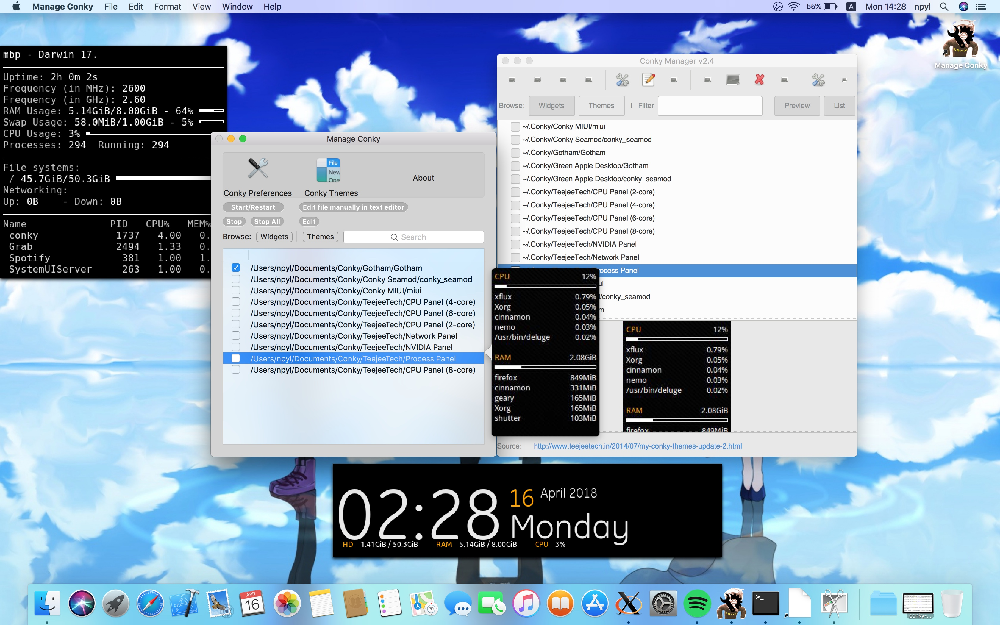

# ***Manage Conky*** [](https://raw.githubusercontent.com/Conky-for-macOS/Manage-Conky/master/LICENSE)


Manage Conky is the implementation of [conky-manager](https://github.com/teejee2008/conky-manager) for macOS.



## INSTALL

To install grab the [Latest Release](https://github.com/Conky-for-macOS/Manage-Conky/releases/latest) or alternatively build it for yourself using the [guide in the wiki](https://github.com/Conky-for-macOS/Manage-Conky/wiki/Build).

## AKNOWLEDGEMENTS 📖

- [conky](https://github.com/brndnmtthws/conky) - The original conky
- [conky-for-macOS](https://github.com/Conky-for-macOS/conky-for-macOS) - The port
- [ConkyX](https://github.com/Conky-for-macOS/ConkyX) - The conky quick-launcher
- [conky-manager](https://github.com/teejee2008/conky-manager) - The app that ManageConky mimics
- [LetsMove](https://github.com/potionfactory/LetsMove) - Ofcourse
- [default-themes](https://github.com/Conky-for-macOS/default-themes) - This is where we get the themes

### This project uses [cocoapods](https://cocoapods.org/) as supplier of these frameworks:
- [Sparkle Framework](https://sparkle-project.org) - Updating mechanism
- [AHLaunchCtl](https://github.com/eahrold/AHLaunchCtl) - Controlling LaunchD

## DONATING 💰

```
BTC: 31qFE5JFeReEftU1sjDqigUDmpxYuTdwQm
BCH: qq04pjvvlx406r7pd9dm3ft2smc4qc2njyjccpd6kw
LTC: 3N1EuxbmeXeTFjLEqmHeZfjK7HUig9XzpX
```

***NOTE:*** ManageConky should always have the up-to-date version of the keys; Just go to **About->Press the Bitcoin icon** and you got it. <br>
Thank you. :beers:
